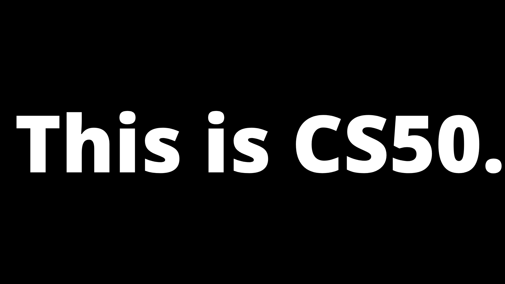
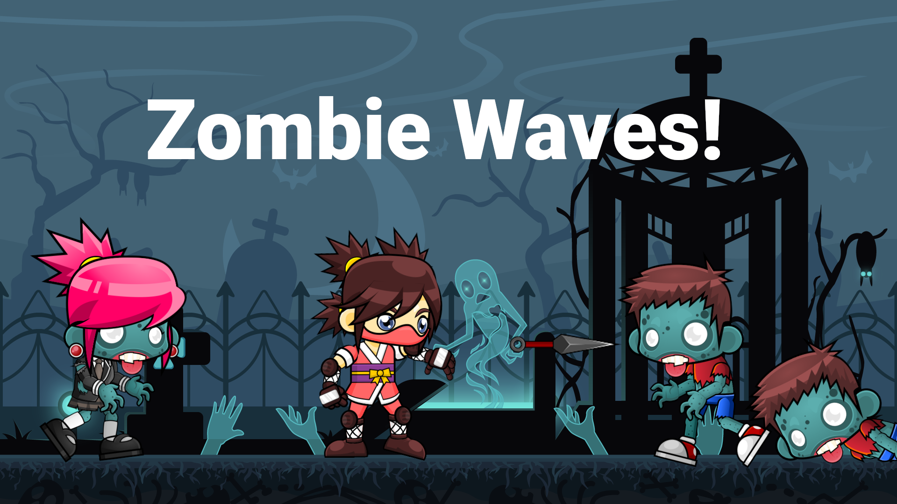

*[English Version](README.md)*

# CS50 - Minha Jornada 

Estou fazendo o curso de introdução à Ciência da Computação **cs50** de **Havard** e decidi documentar todo o meu processo de evolução durante esta jornada, com o objetivo de rastrear os meus aprendizados e incentivar outros estudantes a fazer o mesmo.

## Sumário

  - [Semana 0](#semana-0)
    - [Aula 0](#aula-0)
    - [Problem Set 0](#problem-set-0)

## Semana 0
### Aula 0

  * O que é [Ciência da Computação](https://cs50.harvard.edu/x/2020/notes/0/#what-in-computer-science)
    > Resumidamente, é o processo de resolver problemas!

  * [Sistema Binário](https://cs50.harvard.edu/x/2020/notes/0/#binary)
    > Linguagem em que o computador se comunica. Pegando dados e resumindo-os a 1's e 0's.

  * [Representação de Dados](https://cs50.harvard.edu/x/2020/notes/0/#representing-data)
    > Mostra como os padrões [ASCII](https://pt.wikipedia.org/wiki/ASCII) e [Unicode](https://pt.wikipedia.org/wiki/Unicode) são usados para a representação de dados.

  * [Algorítimos](https://cs50.harvard.edu/x/2020/notes/0/#algorithms)
    > Instruções passo-a-passo para resolver um problema.

  * [Pseudocódigo](https://cs50.harvard.edu/x/2020/notes/0/#pseudocode)
    > Sintaxe informal mais próxima da linguagem humana para representar um algoritmo.

  * [Scratch](https://cs50.harvard.edu/x/2020/notes/0/#scratch)
    > Mostra o que é Scratch e como ele é uma ótima ferramenta para aqueles que estão começando a codar.

### Problem Set 0

#### Implementar o seu próprio projeto utilizando Scratch

O projeto é de sua escolha, pode ser um jogo, uma animação, ou qualquer coisa do tipo, que se encaixe nos seguintes requisitos:
- [ ] Seu projeto deve conter ao menos **dois sprites**, sendo que **pelo menos um**, deva lembrar algo que **não seja um gato**.
- [ ] Seu projeto deve conter ao menos **três sripts** no total (não necessariamente três por sprite)
- [ ] Seu projeto deve conter ao menos **uma condição**, **um loop** e **uma variável**.
- [ ] Seu projeto deve conter ao menos **um som**.
- [ ] Seu projeto deve ser **mais complexo do que os mostrados na aula**, mas pode ser **menos complexo do que o [Ivy's Hardest Game](https://scratch.mit.edu/projects/26329347/)**. Então, seu projeto deve usar algumas dúzias de puzzles.

### Meu Projeto

> Vou fazer um jogo!!!
>
> — Eu, em casa

[](https://scratch.mit.edu/projects/409369635/)

A princípio não tinha ideia e comecei a procurar por algo na internet, na esperança de encontrar algo que ativasse minha criatividade.
Durante a procura vi dois sprites, uma ninja e um zumbi. De imediato, tive uma ideia!

O jogo é simples, você é uma ninja, e não pode deixar os zumbis encostarem em você. Para evitar o toque, você deve atirar sua kunai neles.

Apesar de simples, não foi tão fácil de fazer como pensei!
Existem várias condições a serem implementadas, como, animar as ações, movimentos e objetos dos personagens, adicionar efeitos sonoros em movimentos específicos e por aí vai!

No fim, tudo deu certo! E passei a valorizar ainda mais os joguinhos que jogo no meu celular. Parecem ser tão bobos, mas senti na pele o quão difícil pode ser a implementação destes projetos!

**Você pode [testa-lo](https://scratch.mit.edu/projects/409369635/), e me dar um feedback!!**

## Os Artistas 

Este projeto não seria possível de ser concluído se não tivessem projetos e pessoas fantásticas que disponibilizassem alguns de seus trabalhos para uso livre!
Quem contribuiu com este projeto:

|       Projeto/Artista        |           Projeto           |       Contato     |
|:-------------------:|:---------------------------:|:------------------:|
| [Craftpix](https://craftpix.net/) |   [Background](https://tinyurl.com/y8xgvgoy/)  | [Twitter](https://twitter.com/craftpix_net)  |
| [Gameart2d](https://www.gameart2d.com/) | [Ninja Girl](https://tinyurl.com/yadb7mr6) / [The Zombies](https://tinyurl.com/yaoch38m) | [Twitter](https://twitter.com/pzUH) |
| [Ross Bugden](https://tinyurl.com/y7gpb4u3) | [Background Music](https://tinyurl.com/y7pxmxse) | [Twitter](https://twitter.com/RossBugden) / [Instagram](https://tinyurl.com/ycshp4ph) |
| [Soundbible/Mike Koenig](http://soundbible.com/) | [Slime Splash](http://soundbible.com/1097-Slime-Splash.html) | unknown |

## O que eu aprendi?

Apesar de já ter um certo conhecimento na área, a aula preencheu pequenos gaps de conhecimento que eu tinha. Principalmente na parte de como os dados são representados.

A lição mais importante que tirei desta semana foi que em algum momento, nós sempre vamos precisar de ajuda, independente do que estivermos fazendo.
Abri bem os meus olhos e consigo ver com mais clareza a importância de contribuir na sociedade e comunidade com os nossos projetos

## Week 1 (C)
### Lecture 1

A semana 1 nos apresentou a linguagem C e fez paralelo entre ela e Scratch. Mostrando que elas têm as mesmas funcionalidades, porém a linguagem C, tem uma linguagem menos amigável. 
E de costume, nos é ensinado como fazer o famoso `Hello, world!` em C.

```c
#include <stdio.h>

int main(void)
{
    printf("hello, world\n");
}
```

Mas não parou por aí, a aula também abordou assuntos como: 
  * Compiladores
    > programas utilizados para converter o código para a linguagem das máquinas (binária).

  * Strings
    > é uma sequência de caracteres, geralmente utilizada para representar palavras, frases ou textos de um programa.

  * Bool
    > expressão booleana de `true` e `false`.

  * Char
    > um único caractere, como `a` ou `2`.

  * Double
    > um valor de ponto flutuante, com ainda mais dígitos.

  * Float
    > um valor de ponto flutuante ou número real com um valor decimal.
  
  * Int
    > Números inteiros até um determinado tamanho ou número de bits.

  * Long
    > inteiros com mais bits, para que eles possam contar mais.

## Memória

Nosso computador possui memória, em chips de hardware chamadas RAM, memória de acesso aleatório. Nossos programas usam essa RAM para armazenar dados enquanto são executados, mas essa memória é finita. Portanto, com um número finito de bits, não podemos representar todos os números possíveis. Portanto, nosso computador possui um certo número de bits para cada float e int e precisa arredondar para o valor decimal mais próximo em um determinado ponto.

## Imprecisão

Ocorre quando não temos bits suficientes para armazenar todos os valores possíveis.

## Integer Overflow

Ocorre quando uma operação aritmética tenta criar um valor numérico que está fora do intervalo que pode ser representado com um determinado número de dígitos maior que o valor máximo ou menor que o mínimo representável. 

### Problem Set 1

Os desafios são divididos em **dois níveis**, **menos confortável** e **mais confortável**. 
Onde no nível **menos confortável**, o desafio é **um pouco mais fácil**, ideal para aqueles que estão iniciando agora a programar. 

O **mais confortável** é indicado para aqueles que, como o nome já diz, se **sentem mais confortáveis em programar**. 

Decidi fazer os **dois desafios no nível mais confortável**

## Mario mais confortável

No começo do Mundo 1-1 nos Super Mario Brothers da Nintendo, Mario deve pular sobre pirâmides de blocos adjacentes, conforme abaixo.


O programa que escreveremos será chamado Mario. E vamos permitir que o usuário decida a altura das pirâmides solicitando um **número inteiro** positivo entre, digamos, **1 e 8**, inclusive.

Veja como o programa deve funcionar se o usuário digitar 8 quando solicitado:

```console
$ ./mario
Height: 8
       #  #
      ##  ##
     ###  ###
    ####  ####
   #####  #####
  ######  ######
 #######  #######
########  ########
```

## Credit (mais confortável) 

Neste desafio, precisamos validar cartões de crédito. É necessário aplicar o **[algorítimo de Luhn](https://en.wikipedia.org/wiki/Luhn_algorithm)** para verificar se o cartão é valido ou não, e retornar qual a operadora do cartão de crédito, com base no número fornecido. 

Para maiores detalhes, olhar diretamente na **[página da CS50](https://cs50.harvard.edu/x/2020/psets/1/credit/)**, sobre o desafio. 

**Não postarei a minha solução para os problemas, pois estaria infringindo as regras estabalecidas pelo curso.**

## O que eu aprendi?

Aprendi muito nesta aula! Já tinha ouvido falar em C, mas não fazia ideia de como funcionava. 

Tive um grande choque ao começar a programar nela, pois como comecei a aprender a programar por javascript, foi como se eu tivesse trabalhando com um veterano de guerra muito birrento. Você tem que falar direito com ele, se não, ele te quebra na porrada haha. 

Se você esquecer de pôr um ponto-e-vírgula no javascript, que é uma mãe, não tem problema algum, ela vai lá e põe para você e ainda te dá um beijo.
Já em C, se você esquecer, ele não faz o que você pediu e ainda briga com você.

Entretanto, por mais que eu me sinta muito mais travado programando em C, sinto que estou aprendendo muito. C nos ajuda a entender melhor sobre os tipos de dado, porque se você não souber, ele não funciona. 

Sinto que quando eu voltar mais ativamente para o javascript vou ter evoluído bastante e estarei muito mais preparado. 
